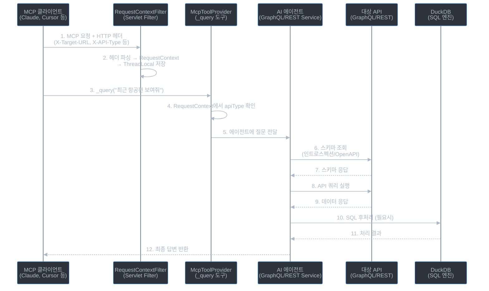

# 01. 프로젝트 개요

## 목차
- [프로젝트란?](#프로젝트란)
- [핵심 개념 설명](#핵심-개념-설명)
- [전체 동작 흐름](#전체-동작-흐름)
- [사용 시나리오 예시](#사용-시나리오-예시)
- [초보자를 위한 단계별 이해](#초보자를-위한-단계별-이해)
- [에이전트 내부 동작 상세 예시](#에이전트-내부-동작-상세-예시)
- [레시피 시스템 쉽게 이해하기](#레시피-시스템-쉽게-이해하기)
- [보안과 대용량 처리 쉽게 이해하기](#보안과-대용량-처리-쉽게-이해하기)
- [사내 MCP 서버 활용 가이드](#사내-mcp-서버-활용-가이드)

---

## 프로젝트란?

**API Agent**는 자연어(일상 언어)로 API에 질문하면, AI 에이전트가 알아서 API를 호출하고 데이터를 가공해서 답변해주는 **MCP 서버**입니다.

이 프로젝트는 [Python FastMCP 기반 원본](https://github.com/agoda-com/api-agent)을 **Spring Boot 4.0 + Java 25**로 포팅한 버전입니다. MCP 서버로서의 동작 방식은 동일하며, 구현체만 Spring AI 기반으로 변경되었습니다.

예를 들어, "최근 10명의 사용자를 보여줘"라고 질문하면:
1. AI 에이전트가 API 스키마를 읽고
2. 적절한 GraphQL 쿼리 또는 REST API 호출을 생성하고
3. API를 실행하고
4. 필요하면 DuckDB로 SQL 후처리까지 수행하여
5. 결과를 반환합니다.

### 왜 필요한가?
- API 문서를 읽고 직접 쿼리를 작성할 필요가 없습니다
- 복잡한 데이터 필터링/집계를 SQL로 자동 처리합니다
- 한번 성공한 질의 패턴을 "레시피"로 캐싱하여 재사용합니다

### Python 원본과의 주요 차이점

| 항목 | Python 원본 | Spring Boot 포팅 |
|------|------------|-----------------|
| 런타임 | Python 3.11 + FastMCP | Java 25 + Spring Boot 4.0 |
| LLM SDK | OpenAI Agents SDK | Spring AI ChatClient |
| 요청 격리 | Python `ContextVar` | Java `ThreadLocal` |
| 동시성 | asyncio | Virtual Threads |
| 미들웨어 | FastMCP Middleware | Servlet Filter + Spring 서비스 |
| HTTP 클라이언트 | httpx (비동기) | Spring RestClient (동기, Virtual Thread) |
| 패키지 관리 | uv / pyproject.toml | Gradle Kotlin DSL |

---

## 핵심 개념 설명

### MCP (Model Context Protocol)
MCP는 AI 모델(예: Claude)이 외부 도구와 소통하기 위한 표준 프로토콜입니다. API Agent는 MCP 서버로 동작하여 AI 클라이언트(예: Claude Desktop, Cursor)에게 **도구(Tool)**를 제공합니다.

> **비유**: MCP는 AI가 사용할 수 있는 "플러그인 규격"이고, API Agent는 그 규격에 맞게 만들어진 "API 질의 플러그인"입니다.

### Agent (에이전트)
에이전트는 Spring AI의 ChatClient를 사용하여 구현된 **자율적인 AI 실행 루프**입니다. `AgentRunner`가 멀티턴 루프를 관리하며, 사용자의 질문을 받으면 스스로 판단하여 도구를 호출하고, 결과를 분석하고, 필요하면 추가 호출을 수행합니다.

- **GraphQL 에이전트** (`GraphqlAgentService`): GraphQL API를 대상으로 동작
- **REST 에이전트** (`RestAgentService`): REST API를 대상으로 동작

### GraphQL
GraphQL은 API 질의 언어입니다. 클라이언트가 원하는 데이터의 구조를 정확하게 지정할 수 있습니다.

```graphql
# "사용자의 이름과 이메일만 가져와줘" 같은 요청을 표현
{
  users(limit: 10) {
    id
    name
    email
  }
}
```

### REST API
REST는 HTTP 메서드(GET, POST 등)와 URL 경로를 사용하는 전통적인 API 방식입니다.

```
GET /users?limit=10        # 사용자 목록 조회
GET /users/123             # 특정 사용자 조회
POST /users                # 사용자 생성 (기본적으로 차단됨)
```

### DuckDB
DuckDB는 가벼운 분석용 SQL 엔진입니다. API에서 가져온 JSON 데이터를 임시 테이블로 만들어 SQL로 필터링, 정렬, 집계 등을 수행합니다.

```sql
-- API에서 가져온 데이터를 SQL로 후처리
SELECT name, COUNT(*) as post_count
FROM users JOIN posts ON users.id = posts.authorId
GROUP BY name
ORDER BY post_count DESC
```

---

## 전체 동작 흐름



### 흐름 요약

| 단계 | 구성요소 | 역할 |
|------|----------|------|
| 1-2 | RequestContextFilter | HTTP 헤더에서 대상 API 정보 추출, ThreadLocal에 저장 |
| 3-5 | McpToolProvider | 클라이언트의 도구 호출을 에이전트로 라우팅 |
| 6-7 | 에이전트 | 대상 API의 스키마를 먼저 조회하여 구조 파악 |
| 8-9 | 에이전트 | AI가 판단한 최적의 쿼리로 API 호출 |
| 10-11 | DuckDB | 필요시 SQL로 데이터 필터링/집계/조인 |
| 12 | 에이전트 | 분석 결과를 자연어 또는 CSV로 반환 |

---

## 사용 시나리오 예시

### 시나리오 1: GraphQL API에 자연어 질의

**설정**: X-Target-URL이 GraphQL 엔드포인트를 가리킴

```
사용자: "조회수가 100 이상인 게시글을 작성한 사용자 이름과 총 조회수를 보여줘"
```

에이전트가 수행하는 작업:
1. GraphQL 인트로스펙션으로 스키마 파악
2. `graphql_query('{ posts { authorId views } }')` 실행
3. `graphql_query('{ users { id name } }', name='u')` 실행
4. `sql_query('SELECT u.name, SUM(views) as total FROM data d JOIN u ON d.authorId = u.id GROUP BY u.name HAVING total >= 100')` 실행
5. 결과 반환

### 시나리오 2: REST API에 자연어 질의

**설정**: X-Target-URL이 OpenAPI 스펙 URL을 가리킴

```
사용자: "서울에서 도쿄행 내일 항공편을 가격순으로 보여줘"
```

에이전트가 수행하는 작업:
1. OpenAPI 스펙에서 엔드포인트 목록 파악
2. `rest_call("GET", "/flights", query_params='{"from": "ICN", "to": "NRT", "date": "2026-03-12"}')` 실행
3. `sql_query('SELECT * FROM data ORDER BY price ASC')` 실행
4. 결과 반환

### 시나리오 3: 레시피 재사용

이전에 "서울→도쿄 항공편 검색"을 성공적으로 수행하면, 시스템이 자동으로 레시피를 추출합니다.
다음에 유사한 질문("서울에서 오사카 항공편은?")이 들어오면, 저장된 레시피를 파라미터만 바꿔서 즉시 실행합니다.

---

## 초보자를 위한 단계별 이해

### 비유로 이해하기

**API Agent = 만능 통역사**라고 생각하세요.

```
[일반 통역사]
한국어→영어 통역사 따로 고용
한국어→일본어 통역사 따로 고용
한국어→중국어 통역사 따로 고용

[만능 통역사 = API Agent]
한 명의 통역사가 어떤 언어든 대응
→ "이번엔 영어로 통역해줘" (헤더로 지정)
→ "이번엔 일본어로 통역해줘" (헤더로 지정)
```

### MCP가 뭔가요?

Claude Desktop(또는 Cursor 같은 AI 도구)을 사용한다고 가정합니다.

```
당신: "우리 회사 항공편 API에서 서울→도쿄 내일 항공편 보여줘"
Claude: "죄송합니다. 저는 인터넷에 접속할 수 없어서 API를 호출할 수 없습니다."
```

Claude 혼자서는 외부 API를 호출할 수 없습니다. 여기서 **MCP(Model Context Protocol)**가 등장합니다.

**MCP = AI에게 "손과 발"을 달아주는 규격**

```
[MCP 없이]
Claude 🧠 → "API 호출하고 싶지만 할 수 없어..."

[MCP 있으면]
Claude 🧠 → MCP 서버 🔧 → 외부 API 🌐
             (도구 제공)     (실제 호출)
```

MCP 서버는 Claude에게 **도구(Tool)**를 제공합니다. Claude가 "이 도구 써줘"라고 요청하면, MCP 서버가 실제 작업을 수행합니다.

### 기존 방식 vs API Agent

회사에 3개의 API가 있다고 가정합니다:

| API | 용도 | 유형 |
|-----|------|------|
| 항공편 API | 항공편 검색 | GraphQL |
| 호텔 API | 호텔 예약 조회 | REST |
| 고객 API | 고객 정보 관리 | REST |

**기존 방식: 각 API마다 전용 MCP 서버 개발**

```
항공편 MCP 서버 (직접 개발)
├── 항공편 검색 도구
├── 항공편 상세 조회 도구
└── GraphQL 쿼리 하드코딩

호텔 MCP 서버 (직접 개발)
├── 호텔 검색 도구
├── 예약 조회 도구
└── REST 호출 하드코딩

고객 MCP 서버 (직접 개발)
├── 고객 조회 도구
├── 주문 내역 도구
└── REST 호출 하드코딩
```

**문제점**:
- API가 추가될 때마다 새 MCP 서버를 **코딩**해야 합니다
- API 스키마가 변경되면 코드를 **수정**해야 합니다
- 각 서버를 별도로 **배포/관리**해야 합니다

**API Agent 방식: 하나로 전부 대응**

```
API Agent (1대만 배포)
├── 어떤 GraphQL API든 → 스키마 자동 분석 → 쿼리 자동 생성
└── 어떤 REST API든    → OpenAPI 스펙 자동 분석 → 호출 자동 생성
```

### 구체적인 예시

**항공편 API(GraphQL)에 질문할 때:**

Claude Desktop 설정:
```json
{
  "mcpServers": {
    "flights": {
      "url": "http://localhost:3000/mcp",
      "headers": {
        "X-Target-URL": "https://flights.company.com/graphql",
        "X-API-Type": "graphql",
        "X-Target-Headers": "{\"Authorization\": \"Bearer flight-token-123\"}"
      }
    }
  }
}
```

```
당신: "서울에서 도쿄로 내일 출발하는 항공편 보여줘"

[내부에서 일어나는 일]
1. API Agent가 https://flights.company.com/graphql 의 스키마를 자동 조회
2. AI 에이전트가 스키마를 읽고 적절한 쿼리 생성:
   { flights(from: "ICN", to: "NRT", date: "2026-03-12") { id airline price } }
3. 쿼리 실행 → 결과 반환

Claude: "내일 서울→도쿄 항공편 3개를 찾았습니다:
         1. 대한항공 KE001 - 350,000원
         2. 아시아나 OZ123 - 320,000원
         3. 일본항공 JL045 - 380,000원"
```

**같은 서버로, 호텔 API(REST)에 질문할 때:**

Claude Desktop 설정 (다른 세션):
```json
{
  "mcpServers": {
    "hotels": {
      "url": "http://localhost:3000/mcp",
      "headers": {
        "X-Target-URL": "https://hotels.company.com/openapi.json",
        "X-API-Type": "rest",
        "X-Target-Headers": "{\"X-API-Key\": \"hotel-key-456\"}"
      }
    }
  }
}
```

```
당신: "도쿄 시부야 근처 호텔 중 1박 10만원 이하인 곳 보여줘"

[내부에서 일어나는 일]
1. API Agent가 https://hotels.company.com/openapi.json 의 OpenAPI 스펙 자동 조회
2. AI 에이전트가 스펙을 읽고:
   - GET /hotels?location=shibuya&city=tokyo 호출
   - DuckDB SQL로 가격 필터링: WHERE price <= 100000
3. 결과 반환

Claude: "시부야 근처 10만원 이하 호텔 2곳입니다:
         1. 도큐 시부야 호텔 - 85,000원/박
         2. 시부야 스트림 호텔 - 95,000원/박"
```

**핵심: 같은 `http://localhost:3000/mcp` 서버인데, 헤더만 다릅니다!**

---

## 에이전트 내부 동작 상세 예시

### 에이전트가 실제로 하는 일 (상세 흐름)

**예시 상황:**
```
당신: "조회수가 100 이상인 게시글 작성자 이름과 총 조회수를 보여줘"
설정: X-Target-URL = https://blog-api.company.com/graphql
```

#### Step 1: 스키마 자동 조회 (인트로스펙션)

에이전트가 가장 먼저 하는 일은 **"이 API에 뭐가 있지?"**를 파악하는 것입니다.

```
에이전트 → blog-api.company.com에 인트로스펙션 쿼리 전송
         "너 어떤 데이터를 가지고 있어? 스키마 알려줘"
```

이 응답을 에이전트가 읽기 쉬운 형태로 변환합니다:

```
<queries>
users(limit: Int!) -> [User!]!        # 사용자 목록
posts(limit: Int!) -> [Post!]!        # 게시글 목록
post(id: ID!) -> Post                 # 게시글 상세

<types>
User {
  id: ID!
  name: String!
  email: String
}

Post {
  id: ID!
  title: String!
  authorId: ID!
  views: Int!
  createdAt: String
}
```

> **비유**: 식당에 가서 메뉴판을 먼저 보는 것과 같습니다. "아, 여기는 users와 posts를 조회할 수 있구나!"

#### Step 2: AI가 전략을 세움

에이전트(LLM)가 스키마 + 질문을 보고 **스스로 판단**합니다:

```
🧠 AI의 사고 과정:

"조회수가 100 이상인 게시글 작성자 이름과 총 조회수를 보여줘"

1. '작성자 이름'이 필요하다 → users 쿼리가 필요하겠군
2. '조회수'가 필요하다 → posts 쿼리에서 views 필드를 가져와야겠군
3. '100 이상 필터링'과 '합계' → SQL로 처리해야겠군
4. users와 posts를 연결하려면 → authorId로 JOIN해야겠군

전략: posts 가져오기 → users 가져오기 → SQL로 JOIN + 필터링
```

#### Step 3: 도구 호출 (턴별 실행)

Spring AI `AgentRunner`가 멀티턴 루프를 관리합니다:

```
━━━ 턴 1/30 ━━━━━━━━━━━━━━━━━━━━━━━━━━━━━━━━

🧠 AI: graphql_query 도구를 호출하겠습니다

  graphql_query(
    query: "{ posts { authorId views } }",
    name: "p"    ← DuckDB에서 사용할 테이블 이름
  )

🔧 도구 실행:
  → blog-api.company.com/graphql 에 쿼리 전송
  ← 응답: [
      {"authorId": "1", "views": 150},
      {"authorId": "1", "views": 80},
      {"authorId": "2", "views": 200},
      {"authorId": "2", "views": 30},
      {"authorId": "3", "views": 120}
    ]
  → DuckDB 테이블 "p"에 저장됨

━━━ 턴 2/30 ━━━━━━━━━━━━━━━━━━━━━━━━━━━━━━━━

🧠 AI: 이제 사용자 이름이 필요하니 users도 가져옵시다

  graphql_query(
    query: "{ users { id name } }",
    name: "u"    ← 테이블 이름 "u"
  )

🔧 도구 실행:
  → 쿼리 전송
  ← 응답: [
      {"id": "1", "name": "김철수"},
      {"id": "2", "name": "이영희"},
      {"id": "3", "name": "박민수"}
    ]
  → DuckDB 테이블 "u"에 저장됨

━━━ 턴 3/30 ━━━━━━━━━━━━━━━━━━━━━━━━━━━━━━━━

🧠 AI: 두 테이블이 있으니 SQL로 JOIN해서 필터링하겠습니다

  sql_query(
    sql: "SELECT u.name, SUM(p.views) as total_views
          FROM p
          JOIN u ON p.authorId = u.id
          GROUP BY u.name
          HAVING total_views >= 100
          ORDER BY total_views DESC"
  )

🔧 도구 실행 (DuckDB):
  ← 결과: [
      {"name": "이영희", "total_views": 230},
      {"name": "김철수", "total_views": 230},
      {"name": "박민수", "total_views": 120}
    ]

━━━ 턴 4/30 ━━━━━━━━━━━━━━━━━━━━━━━━━━━━━━━━

🧠 AI: 결과가 나왔으니 답변을 작성합니다 (도구 호출 없음 → 종료)
```

#### 최종 응답

```
Claude: "조회수 100 이상인 게시글 작성자별 총 조회수입니다:

         | 작성자   | 총 조회수 |
         |---------|----------|
         | 이영희   | 230      |
         | 김철수   | 230      |
         | 박민수   | 120      |"
```

### DuckDB가 하는 역할

대부분의 API는 **단순 조회만 제공**합니다:

```
API가 해주는 것:    "게시글 목록을 줄게"
API가 못 해주는 것:  "조회수 100 이상인 것만 작성자별로 합산해서 줘"
```

그래서 API에서 원시 데이터를 받고, **DuckDB로 필터링/정렬/집계/JOIN**을 합니다.

DuckDB 동작 과정 (내부):

```
1. API 응답 (JSON 배열)
   [{"authorId": "1", "views": 150}, {"authorId": "1", "views": 80}, ...]

2. 임시 JSON 파일로 저장
   /tmp/abc123.json

3. DuckDB가 읽어서 테이블 생성
   CREATE TABLE p AS SELECT * FROM read_json_auto('/tmp/abc123.json')

4. SQL 실행
   SELECT ... FROM p JOIN u ON ...

5. 결과 반환 + 임시 파일 삭제
```

> **비유**: Excel에 데이터를 붙여넣고 피벗 테이블을 만드는 것과 비슷합니다. 다만 SQL로 하는 것이죠.

### 도구 이름이 바뀌는 이유

Claude Desktop에서 항공편 API와 호텔 API를 **동시에** 연결했다고 합시다:

```
[만약 도구 이름이 같다면]
Claude가 보는 도구 목록:
  - query    ← 항공편용? 호텔용? 구분 불가!
```

`ToolNamingService`가 세션별로 이름을 변환합니다:

```
내부 이름     →  항공편 세션          호텔 세션
─────────    ─  ─────────────      ─────────────
_query       →  flights_query      hotels_query
```

URL에서 의미 있는 부분을 추출하는 방식:

```
https://flights-api-qa.internal.example.com/graphql
        ↓
        "flights", "api", "qa", "internal", "example", "com"
        ↓ (의미 없는 것 제거: com, internal, api, qa)
        "flights", "example"
        ↓
        flights_example_query  (도구 이름)
```

### `return_directly` - 똑똑한 최적화

에이전트(AI)가 항상 답변을 만들 필요는 없습니다:

```
[분석이 필요한 질문]
"가장 비싼 항공편은?"
→ AI가 데이터를 보고 판단해서 답변해야 함
→ return_directly = false

[데이터만 달라는 질문]
"항공편 목록 보여줘"
→ AI가 분석할 필요 없이 데이터만 전달하면 됨
→ return_directly = true (AI 분석 건너뛰기 → 더 빠름!)
```

```
return_directly=true 일 때 흐름:

사용자 → 에이전트 → API 호출 → 데이터 → [AI 분석 건너뜀] → CSV로 바로 반환
                                              ↑
                                        이 단계를 생략!
```

---

## 레시피 시스템 쉽게 이해하기

### 문제 상황

```
월요일: "서울에서 도쿄 내일 항공편 보여줘"
  → 에이전트가 스키마 읽고 → 전략 세우고 → 쿼리 만들고 → 실행 (약 10초)

화요일: "서울에서 오사카 내일 항공편 보여줘"
  → 에이전트가 스키마 읽고 → 전략 세우고 → 쿼리 만들고 → 실행 (또 10초)
  → 거의 같은 작업인데 처음부터 다시?!
```

### 해결: 성공한 패턴을 "레시피"로 저장

요리 레시피처럼 생각하세요:

```
[첫 번째 요리]
"김치찌개 만들어줘" → 재료 찾고, 레시피 검색하고, 시행착오... (오래 걸림)

[레시피 저장]
"아, 이렇게 하면 되는구나" → 레시피 노트에 기록

[두 번째 요리]
"된장찌개 만들어줘" → 비슷한 레시피 찾기 → 재료만 바꿔서 즉시 실행!
```

### 실제 동작 과정

**1단계: 첫 번째 질문 (에이전트 실행)**

```
사용자: "서울에서 도쿄 내일 항공편 보여줘"

에이전트 실행:
  턴1: graphql_query('{ flights(from: "ICN", to: "NRT", date: "2026-03-12") { ... } }')
  턴2: sql_query('SELECT * FROM data ORDER BY price ASC')
  → 성공!
```

**2단계: 레시피 자동 추출 (백그라운드)**

성공 직후, `RecipeExtractor`가 별도의 LLM 호출로 실행 기록을 분석합니다:

```
"이 실행에서 사용자별로 바뀌는 값은 뭐지?"
→ "ICN" (출발지), "NRT" (도착지), "2026-03-12" (날짜)
→ 이것들을 파라미터로 만들자!
```

추출된 레시피:

```json
{
  "tool_name": "search_flights",
  "params": {
    "from": {"type": "str", "default": "ICN"},
    "to": {"type": "str", "default": "NRT"},
    "date": {"type": "str", "default": "2026-03-12"}
  },
  "steps": [
    {
      "kind": "graphql",
      "name": "data",
      "query_template": "{ flights(from: \"{{from}}\", to: \"{{to}}\", date: \"{{date}}\") { id airline price departureTime } }"
    }
  ],
  "sql_steps": [
    "SELECT * FROM data ORDER BY price ASC"
  ]
}
```

**3단계: 레시피가 MCP 도구로 노출됨**

Claude가 보는 도구 목록이 자동으로 업데이트됩니다:

```
기존: flights_query
추가: r_search_flights  ← 새로 생긴 레시피 도구!
```

**4단계: 유사한 질문이 들어옴**

```
사용자: "서울에서 오사카 모레 항공편 보여줘"

에이전트 사고 과정:
  🧠 "레시피 목록에 search_flights가 있네?"
  🧠 "파라미터만 바꾸면 되겠다"

  search_flights(from="ICN", to="KIX", date="2026-03-13")
  → 에이전트 없이 바로 실행! (훨씬 빠름)
```

### 레시피 동작 비교

```
[레시피 없이 - 매번 에이전트 실행]
질문 → 스키마 조회 → AI 전략 수립 → 쿼리 생성 → API 호출 → SQL → 답변
       ~~~~~~~~~~~~~~~~~~~~~~~~~~~~~~~~~~~~~~~~
       이 전체 과정에 LLM 여러 번 호출 (느림, 비용 높음)

[레시피 사용]
질문 → 유사 레시피 발견 → 파라미터 교체 → API 호출 → SQL → 답변
                          ~~~~~~~~~~~~~~
                          LLM 호출 없음! (빠름, 비용 낮음)
```

---

## 보안과 대용량 처리 쉽게 이해하기

### 뮤테이션/위험 메서드 차단

#### GraphQL: 뮤테이션(데이터 변경) 완전 차단

```
[허용] 데이터 읽기
  { users { id name } }                    ✅ 통과

[차단] 데이터 변경
  mutation { deleteUser(id: "123") }       ❌ 차단!
  mutation { updateUser(name: "해커") }    ❌ 차단!
```

> 해제할 수 없습니다. 코드에 하드코딩되어 있어서, 설정으로 끌 수 없습니다.

#### REST: 위험한 HTTP 메서드 기본 차단

```
GET /users          ✅ 항상 허용 (읽기만 하니까)
POST /users         ❌ 기본 차단 (새 데이터 생성)
PUT /users/123      ❌ 기본 차단 (데이터 수정)
DELETE /users/123   ❌ 기본 차단 (데이터 삭제)
PATCH /users/123    ❌ 기본 차단 (데이터 부분 수정)
```

#### 특정 경로만 허용하기

일부 API는 검색할 때도 POST를 사용합니다. 이런 경우 특정 경로만 허용할 수 있습니다:

```
헤더 설정:
X-Allow-Unsafe-Paths: ["/search", "/api/trips/*/poll"]

결과:
POST /search              ✅ 허용 (패턴 매칭)
POST /api/trips/123/poll  ✅ 허용 (* 와일드카드)
POST /users               ❌ 여전히 차단
DELETE /search             ✅ 허용 (/search 경로니까)
```

> **보안 요약**: GraphQL mutation → 무조건 차단 (해제 불가) / REST POST/PUT/DELETE/PATCH → 기본 차단, `X-Allow-Unsafe-Paths` 헤더로 특정 경로만 허용 가능

### 응답 잘림 3단계 안전장치

API 응답이 너무 크면 LLM 컨텍스트 윈도우를 초과합니다. 이를 방지하는 3단계 안전장치가 있습니다.

#### 안전장치 1: 스키마 잘림

API 스키마가 32,000자를 초과하면:

```
1차) 설명(#comment) 제거
  users(limit: Int!) -> [User!]!  # 사용자 목록 조회
  →
  users(limit: Int!) -> [User!]!

2차) 그래도 초과하면 잘라내기
  ... (32,000자까지만)
  [SCHEMA TRUNCATED - use search_schema() to explore]

  → 에이전트가 search_schema("user") 도구로 필요한 부분만 검색 가능
```

#### 안전장치 2: 도구 응답 잘림

API에서 1만 건의 데이터가 왔을 때:

```
전체: 10,000행 (2MB)
      ↓ 32,000자 이내로 잘림
표시: 50행만 포함 + 스키마 정보

{
  "table": "data",
  "rows": 10000,           ← 전체는 1만 건이지만
  "showing": 50,           ← 50건만 보여줌
  "schema": "id: INTEGER, name: VARCHAR, email: VARCHAR",
  "data": [...50건...],
  "truncated": true,
  "hint": "Showing 50/10000. Use sql_query to filter."
}

→ 에이전트: "전체 데이터는 DuckDB에 있으니 SQL로 필터링하자!"
  sql_query("SELECT * FROM data WHERE name LIKE '김%' LIMIT 10")
```

#### 안전장치 3: 단일 객체 응답

API가 거대한 단일 객체를 반환했을 때 (예: 설정 파일 전체):

```
{
  "table": "data",
  "rows": 1,
  "schema": "config_a: VARCHAR, config_b: INTEGER, config_c: STRUCT(...)",
  "hint": "Use sql_query() to access fields. Example: SELECT config_a FROM data"
}

→ 데이터 전체 대신 스키마 요약만 제공
→ 에이전트가 SQL로 필요한 필드만 조회
```

---

## 사내 MCP 서버 활용 가이드

### API Agent의 본질

```
"이미 존재하는 GraphQL/REST API"를 "자연어로 읽기(조회)" 해주는 도구
→ 이것에 맞으면 ✅, 안 맞으면 ❌
```

### 적합/부적합 판단 기준 (플로우차트)

```
이 MCP의 주요 기능이 뭔가요?
    │
    ├─ "기존 API에서 데이터 조회"
    │   └─ ✅ API Agent 적합
    │       예: 상품 조회, 주문 내역, 직원 정보, 대시보드 데이터
    │
    ├─ "데이터 변경/생성"
    │   └─ ⚠️ 제한적 (POST/PUT/DELETE 기본 차단)
    │       X-Allow-Unsafe-Paths로 특정 경로만 허용 가능
    │       예: 검색용 POST는 가능, 주문 생성은 위험
    │
    ├─ "파일 시스템/코드 생성/명령어 실행"
    │   └─ ❌ API Agent 부적합 → 별도 MCP 서버 필요
    │       예: 프레임워크 도우미, 코드 리뷰어, 배포 도우미
    │
    ├─ "외부 서비스 연동" (Slack, Jira, GitHub 등)
    │   └─ ⚠️ 해당 서비스에 REST API가 있으면 가능
    │       단, 읽기 위주만 안전하게 가능
    │
    └─ "전문 지식/로직 제공"
        └─ ❌ API Agent 부적합 → 별도 MCP 서버 필요
            예: 코딩 컨벤션 가이드, 아키텍처 자문
```

### ✅ 적합한 경우: 기존 API에서 데이터 조회

이미 상품 API가 있는 경우:

```
사내 상황:
  - 상품팀이 REST API를 이미 운영 중
  - GET /products, GET /products/{id}, GET /categories 등
  - OpenAPI 스펙 문서도 있음

API Agent 사용:
  헤더만 설정하면 바로 사용 가능!

  X-Target-URL: https://internal-products.company.com/openapi.json
  X-API-Type: rest
  X-Target-Headers: {"Authorization": "Bearer internal-token"}

사용자: "카테고리별 재고가 10개 이하인 상품 목록 보여줘"
→ 별도 MCP 서버 개발 없이 즉시 사용 가능!
→ API 스펙이 변경되어도 코드 수정 불필요!
```

### ❌ 부적합한 경우

**상품 API가 없는 경우 (DB 직접 쿼리 필요):**

```
사내 상황:
  - 상품 데이터가 DB에만 있음 (PostgreSQL)
  - API 없이 직접 DB 쿼리가 필요

→ API Agent는 API를 호출하는 도구입니다. DB에 직접 연결하는 기능은 없습니다.
→ 별도 MCP 서버를 만들거나, 먼저 상품 API를 만든 후 API Agent를 연결해야 합니다.
```

### ⚠️ 제한적 사용: 데이터 변경, 외부 서비스 연동

POST/PUT/DELETE가 필요한 경우 `X-Allow-Unsafe-Paths`로 특정 경로만 허용할 수 있지만, 데이터 변경 작업은 신중하게 판단해야 합니다. 외부 서비스(Slack, Jira 등)의 경우 REST API가 있으면 읽기 위주로 연동 가능합니다.

### 현실적 유용 시나리오

#### API Agent가 빛나는 경우

| 시나리오 | 설명 |
|----------|------|
| **내부 API 탐색기** | "이 API에 어떤 엔드포인트가 있어?" → 스키마 자동 분석 |
| **데이터 조회 허브** | 상품/주문/고객/재고 등 여러 API를 하나의 서버로 질의 |
| **비개발자용 데이터 조회** | 기획자/PM이 SQL 몰라도 자연어로 데이터 추출 |
| **API 통합 분석** | 여러 API 데이터를 DuckDB JOIN으로 교차 분석 |
| **신규 API 검증** | 새 API 배포 후 빠르게 테스트 (코드 작성 없이) |

#### 별도 MCP 서버를 만들어야 하는 경우

| 시나리오 | 이유 |
|----------|------|
| **프레임워크 구성 도우미** | 파일 생성, 명령어 실행 등 API 호출이 아닌 작업 |
| **코드 리뷰/생성 도우미** | 코드 분석, 파일 읽기/쓰기 필요 |
| **DB 직접 쿼리** | API가 아닌 DB 연결 필요 |
| **CI/CD 파이프라인 관리** | 배포, 빌드 트리거 등 복잡한 워크플로우 |
| **사내 문서 검색 (RAG)** | 문서 임베딩 + 벡터 검색이 필요 |

### 사내 추천 전략 (3단계)

```
1단계: 이미 API가 있는 서비스 → API Agent 연결 (개발 비용 0)
       상품 API, 주문 API, 직원 API 등

2단계: API가 없지만 데이터 조회가 필요 → 간단한 REST API 먼저 구축 → API Agent 연결
       DB 테이블 위에 얇은 API 레이어만 씌우면 됨

3단계: API 호출이 아닌 작업 → 별도 MCP 서버 개발
       프레임워크 도우미, 코드 생성기, 문서 검색 등
```

> **핵심**: API Agent는 "기존 API를 자연어로 조회하는 게이트웨이"입니다. API가 존재하는 **데이터 조회** 영역에서는 MCP 서버를 직접 만들 필요 없이 바로 사용할 수 있어서 매우 유용하지만, API 밖의 작업(파일 조작, 코드 생성, 복잡한 비즈니스 로직)에는 적합하지 않습니다.

---

## 다음 단계

- [02. 설치 및 실행](./02-설치-및-실행.md) - 프로젝트를 로컬에서 실행하는 방법
- [03. 아키텍처](./03-아키텍처.md) - 시스템 내부 구조 상세 설명
