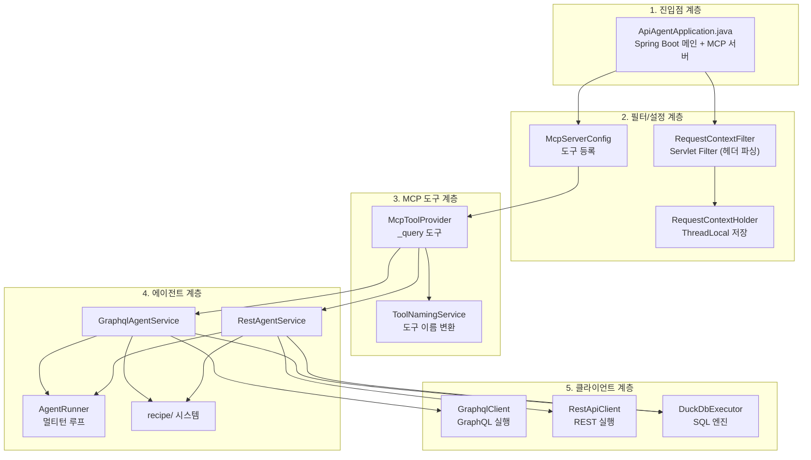
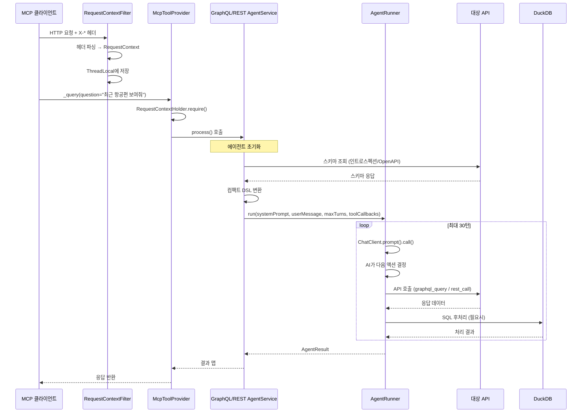
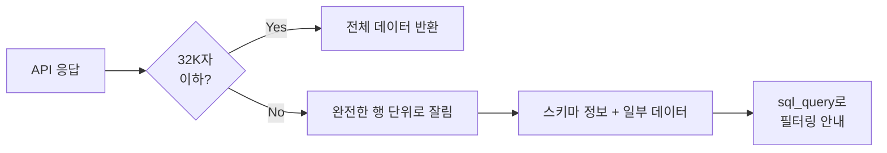

# 03. 아키텍처

## 목차
- [디렉토리 구조](#디렉토리-구조)
- [계층별 역할](#계층별-역할)
- [요청 흐름 상세](#요청-흐름-상세)
- [ThreadLocal 기반 요청 격리](#threadlocal-기반-요청-격리)
- [주요 설정값과 제한](#주요-설정값과-제한)

---

## 디렉토리 구조

```
api-ai-agent/
├── src/main/java/com/apiagent/
│   ├── ApiAgentApplication.java       # 진입점: Spring Boot 메인 클래스
│   │
│   ├── config/                        # 설정
│   │   ├── ApiAgentProperties.java    # 환경변수 기반 설정 (record)
│   │   ├── McpServerConfig.java       # MCP 서버 도구 등록
│   │   ├── CorsConfig.java            # CORS 설정
│   │   ├── WebClientConfig.java       # RestClient 타임아웃 설정
│   │   └── GlobalExceptionHandler.java # 전역 예외 처리
│   │
│   ├── context/                       # 요청 컨텍스트
│   │   ├── RequestContext.java        # HTTP 헤더 → 컨텍스트 (record)
│   │   ├── RequestContextFilter.java  # Servlet Filter (헤더 파싱)
│   │   └── RequestContextHolder.java  # ThreadLocal 기반 컨텍스트 저장
│   │
│   ├── client/                        # API 클라이언트
│   │   ├── graphql/
│   │   │   └── GraphqlClient.java     # GraphQL 실행 (mutation 차단)
│   │   └── rest/
│   │       ├── RestApiClient.java     # REST 실행 (unsafe 메서드 차단)
│   │       └── OpenApiSchemaLoader.java # OpenAPI 스펙 로딩/파싱
│   │
│   ├── executor/
│   │   └── DuckDbExecutor.java        # DuckDB SQL 실행 엔진
│   │
│   ├── agent/                         # AI 에이전트 로직
│   │   ├── AgentRunner.java           # 멀티턴 에이전트 실행 루프
│   │   ├── GraphqlAgentService.java   # GraphQL 에이전트
│   │   ├── RestAgentService.java      # REST 에이전트
│   │   ├── AgentToolFactory.java      # 에이전트 도구 생성 팩토리
│   │   ├── AgentPrompts.java          # 시스템 프롬프트 조각
│   │   ├── SchemaSearchTool.java      # grep 방식 스키마 검색
│   │   ├── TurnTracker.java           # 턴 추적 (Turn 1/30)
│   │   └── SqlQueryTool.java          # SQL 쿼리 도구
│   │
│   ├── mcp/                           # MCP 도구 제공
│   │   ├── McpToolProvider.java       # @Tool 메서드 (_query)
│   │   └── ToolNamingService.java     # 동적 도구 이름 생성
│   │
│   ├── recipe/                        # 레시피 시스템
│   │   ├── RecipeStore.java           # LRU 캐시, 유사도 매칭
│   │   ├── RecipeRecord.java          # 레시피 데이터 모델
│   │   ├── RecipeExtractor.java       # LLM 기반 레시피 추출
│   │   ├── RecipeRunner.java          # 에이전트 없이 레시피 실행
│   │   ├── TemplateRenderer.java      # 텍스트/구조적 치환
│   │   └── RecipeNaming.java          # 도구 이름 정규화
│   │
│   ├── util/                          # 공유 유틸리티
│   │   ├── ResponseTruncator.java     # 3단계 응답 잘림
│   │   └── CsvConverter.java          # DuckDB 기반 CSV 변환
│   │
│   └── tracing/
│       └── TracingConfig.java         # OpenTelemetry 설정
│
├── src/main/resources/
│   └── application.yml                # Spring Boot 설정 파일
│
├── src/test/java/com/apiagent/        # 테스트 (11 파일, 52 케이스)
│
├── build.gradle.kts                   # Gradle 빌드 설정 (Kotlin DSL)
├── Dockerfile                         # Docker 빌드 설정
└── docker-compose.yml                 # Docker Compose 설정
```

---

## 계층별 역할

시스템은 5개의 주요 계층으로 구성됩니다:



### 각 계층 설명

| 계층 | 모듈 | 역할 |
|------|------|------|
| **1. 진입점** | `ApiAgentApplication` | Spring Boot 앱 시작, MCP 서버 자동 구성 |
| **2. 필터/설정** | `RequestContextFilter`, `McpServerConfig` 등 | HTTP 헤더에서 API 정보 추출, ThreadLocal 저장, MCP 도구 등록 |
| **3. MCP 도구** | `McpToolProvider`, `ToolNamingService` | MCP 프로토콜로 노출되는 도구 정의, 세션별 도구 이름 변환 |
| **4. 에이전트** | `AgentRunner`, `*AgentService`, `recipe/` | AI 에이전트 멀티턴 실행 루프, 레시피 추출/매칭/실행 |
| **5. 클라이언트** | `GraphqlClient`, `RestApiClient`, `DuckDbExecutor` | 실제 API 호출 (RestClient)과 데이터 처리 (DuckDB) |

### Python 원본과의 계층 매핑

| Python 원본 | Spring Boot 포팅 |
|-------------|-----------------|
| `__main__.py` (FastMCP 앱) | `ApiAgentApplication` + `McpServerConfig` |
| `middleware.py` (DynamicToolNaming) | `ToolNamingService` + `RequestContextFilter` |
| `context.py` (ContextVar) | `RequestContext` + `RequestContextHolder` (ThreadLocal) |
| `tools/query.py` | `McpToolProvider._query()` |
| `agent/graphql_agent.py` | `GraphqlAgentService` + `AgentRunner` |
| `agent/rest_agent.py` | `RestAgentService` + `AgentRunner` |
| `graphql/client.py` (httpx) | `GraphqlClient` (RestClient) |
| `rest/client.py` (httpx) | `RestApiClient` (RestClient) |

---

## 요청 흐름 상세

### 도구 호출 (call_tool) - 쿼리



---

## ThreadLocal 기반 요청 격리

### 문제: 동시 요청 처리

여러 클라이언트가 동시에 요청을 보내면, 각 요청의 데이터가 섞이면 안 됩니다.

### Python 원본의 접근: ContextVar

Python 원본은 `ContextVar`를 사용하여 비동기 태스크별 독립 저장공간을 제공했습니다.

### Spring Boot의 접근: ThreadLocal + Virtual Threads

Spring Boot에서는 `ThreadLocal`을 사용하며, **Virtual Threads**(가상 스레드)로 동시성을 처리합니다.

```java
// RequestContextHolder.java
public final class RequestContextHolder {
    private static final ThreadLocal<RequestContext> HOLDER = new ThreadLocal<>();

    public static void set(RequestContext ctx) { HOLDER.set(ctx); }
    public static RequestContext get() { return HOLDER.get(); }
    public static RequestContext require() {
        RequestContext ctx = HOLDER.get();
        if (ctx == null) throw new IllegalStateException("RequestContext not set");
        return ctx;
    }
    public static void clear() { HOLDER.remove(); }
}
```

```java
// RequestContextFilter.java - Servlet Filter
@Override
public void doFilter(ServletRequest req, ServletResponse resp, FilterChain chain) {
    HttpServletRequest request = (HttpServletRequest) req;
    try {
        RequestContext ctx = parseHeaders(request);  // HTTP 헤더 파싱
        RequestContextHolder.set(ctx);               // ThreadLocal에 저장
        chain.doFilter(req, resp);                   // 다음 필터/핸들러 실행
    } finally {
        RequestContextHolder.clear();                // 반드시 정리
    }
}
```

### Python ContextVar vs Java ThreadLocal 비교

| 항목 | Python `ContextVar` | Java `ThreadLocal` |
|------|--------------------|--------------------|
| 범위 | 비동기 태스크(코루틴) | 스레드 |
| 동시성 모델 | asyncio (이벤트 루프) | Virtual Threads (스레드 풀) |
| 자식 전파 | 자식 태스크에 자동 복사 (set은 전파 안 됨) | 자식 스레드에 전파 안 됨 |
| Mutable Container 필요 | 예 (list 감싸기) | 불필요 (같은 스레드 내에서 동작) |
| 정리 | 태스크 종료 시 자동 | `finally` 블록에서 `remove()` 필수 |

### AgentRunner의 상태 관리

Python 원본은 `ContextVar`에 쿼리 결과, 실행 기록 등을 저장했으나, Spring Boot에서는 `AgentToolFactory.AgentState`에 메서드 로컬로 관리합니다:

```java
// AgentToolFactory.AgentState - 에이전트 실행 중 상태
static class AgentState {
    Map<String, List<?>> queryResults = new HashMap<>();  // DuckDB 테이블
    Object lastResult;                                     // 최종 결과
    List<String> executedQueries = new ArrayList<>();      // GraphQL 쿼리 기록
    List<Map<String, Object>> apiCalls = new ArrayList<>(); // REST 호출 기록
    List<String> sqlSteps = new ArrayList<>();              // SQL 쿼리 기록
    boolean returnDirectly = false;                         // 직접 반환 플래그
}
```

이 상태 객체는 각 요청의 에이전트 실행 시 새로 생성되므로, 별도의 격리 메커니즘 없이도 요청 간 데이터가 섞이지 않습니다.

---

## 주요 설정값과 제한

### 응답 크기 제한

| 설정 | 기본값 | 설명 |
|------|--------|------|
| `maxToolResponseChars` | 32,000자 (~8K 토큰) | 도구 응답의 최대 크기. LLM 컨텍스트 오버플로우 방지 |
| `maxResponseChars` | 50,000자 | MCP 도구의 최대 응답 크기 |
| `maxSchemaChars` | 32,000자 | 스키마 컨텍스트의 최대 크기 |
| `maxPreviewRows` | 10행 | 페이지네이션 제안 전 미리보기 행 수 |

### 에이전트 제한

| 설정 | 기본값 | 설명 |
|------|--------|------|
| `maxAgentTurns` | 30턴 | 에이전트의 최대 도구 호출 횟수 |
| `maxPolls` | 20회 | 폴링 최대 시도 횟수 (REST) |
| `defaultPollDelayMs` | 3,000ms | 폴링 간격 기본값 |

### 레시피 제한

| 설정 | 기본값 | 설명 |
|------|--------|------|
| `enableRecipes` | `true` | 레시피 기능 활성화 |
| `recipeCacheSize` | 64개 | LRU 캐시 최대 항목 수 |

### 데이터 잘림(Truncation) 전략

대용량 데이터가 LLM 컨텍스트를 초과하지 않도록 다단계 잘림이 적용됩니다:



1. **전체 데이터가 32K 이내**: 그대로 반환
2. **초과 시**: 완전한 행(row) 단위로 잘라서 반환 + 스키마 정보 포함
3. **단일 객체(dict)**: DuckDB 스키마 요약만 반환하고 SQL 사용 안내

---

## 다음 단계

- [04. 핵심 모듈 분석](./04-핵심-모듈-분석.md) - 각 모듈의 코드 상세 분석
- [05. 에이전트 시스템](./05-에이전트-시스템.md) - AI 에이전트 동작 원리
