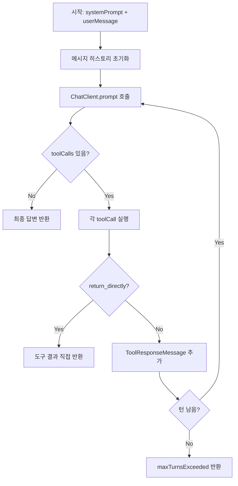
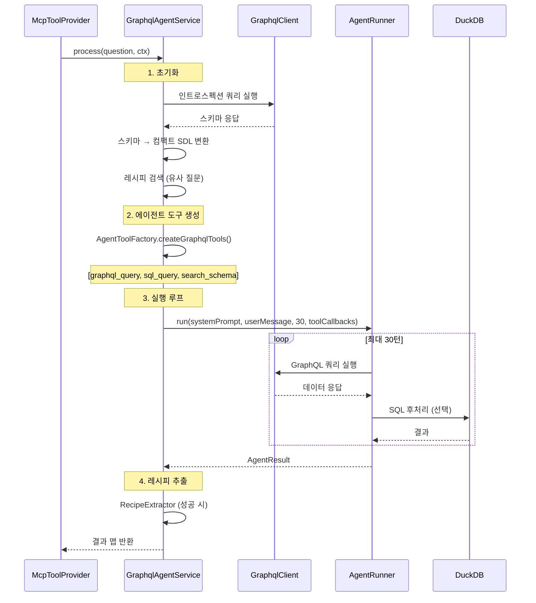

# 05. 에이전트 시스템

## 목차
- [Spring AI ChatClient 기반 에이전트](#spring-ai-chatclient-기반-에이전트)
- [AgentRunner: 멀티턴 실행 루프](#agentrunner-멀티턴-실행-루프)
- [GraphQL 에이전트](#graphql-에이전트)
- [REST 에이전트](#rest-에이전트)
- [AgentToolFactory: 도구 생성](#agenttoolfactory-도구-생성)
- [공유 컴포넌트](#공유-컴포넌트)

---

## Spring AI ChatClient 기반 에이전트

### Python 원본과의 핵심 차이

Python 원본은 **OpenAI Agents SDK**를 사용하여 에이전트를 구현했습니다. SDK가 내부적으로 멀티턴 루프, 도구 호출, 결과 피드백을 자동 관리했습니다.

Spring Boot 포팅에서는 **Spring AI ChatClient**를 사용하되, 멀티턴 루프를 `AgentRunner`에서 **직접 구현**합니다.

| 항목 | Python (OpenAI Agents SDK) | Spring Boot (Spring AI) |
|------|---------------------------|------------------------|
| LLM 호출 | `Runner.run(agent, query, max_turns=30)` | `AgentRunner.run(systemPrompt, userMsg, maxTurns, callbacks)` |
| 도구 정의 | `@function_tool` 데코레이터 | `Map<String, Function>` 콜백 맵 |
| 턴 관리 | SDK 자동 (`max_turns` 파라미터) | `AgentRunner` + `TurnTracker` |
| 도구 결과 피드백 | SDK 자동 | 메시지 히스토리에 직접 추가 |
| 직접 반환 | `tool_use_behavior` 훅 | `return_directly` 플래그 확인 |

### 에이전트 턴(Turn) 개념

한 "턴"은 LLM이 한 번 추론하고 도구를 호출하는 것입니다:

```
턴 1: LLM → "스키마를 보니 users 쿼리가 있군" → graphql_query 호출
턴 2: LLM → "데이터를 받았으니 필터링해야지" → sql_query 호출
턴 3: LLM → "결과가 준비됐으니 답변하자" → 최종 답변 출력
```

30턴 내에 완료하지 못하면 부분 결과를 반환합니다.

---

## AgentRunner: 멀티턴 실행 루프

**파일 위치**: `src/main/java/com/apiagent/agent/AgentRunner.java`

Python 원본의 `Runner.run()` 호출을 대체하는 핵심 컴포넌트입니다.

### 동작 원리



### 핵심 코드 구조

```java
@Service
public class AgentRunner {

    private final ChatClient chatClient;

    public AgentResult run(
            String systemPrompt,
            String userMessage,
            int maxTurns,
            Map<String, Function<Map<String, Object>, String>> toolCallbacks
    ) {
        TurnTracker tracker = new TurnTracker(maxTurns);
        List<Message> messages = new ArrayList<>();
        messages.add(new SystemMessage(systemPrompt));
        messages.add(new UserMessage(userMessage));

        while (tracker.hasRemaining()) {
            // 1. ChatClient 호출
            ChatResponse response = chatClient.prompt()
                    .messages(messages)
                    .call()
                    .chatResponse();

            // 2. 도구 호출 확인
            List<ToolCall> toolCalls = response.getToolCalls();
            if (toolCalls == null || toolCalls.isEmpty()) {
                // 최종 답변
                return new AgentResult(response.getContent(), false, false);
            }

            // 3. 각 도구 실행
            for (ToolCall toolCall : toolCalls) {
                Map<String, Object> args = parseArguments(toolCall.arguments());
                String result = toolCallbacks.get(toolCall.name()).apply(args);

                // 4. return_directly 확인
                if (/* return_directly 플래그 */) {
                    return new AgentResult(result, true, false);
                }

                // 5. 결과를 메시지 히스토리에 추가
                messages.add(new ToolResponseMessage(toolCall.id(), result));
            }
            tracker.increment();
        }

        return new AgentResult(null, false, true);  // maxTurnsExceeded
    }
}
```

### AgentResult

```java
public record AgentResult(
    String finalOutput,        // 최종 답변 텍스트
    boolean directReturn,     // return_directly로 반환됨
    boolean maxTurnsExceeded  // 최대 턴 초과
) {}
```

---

## GraphQL 에이전트

**파일 위치**: `src/main/java/com/apiagent/agent/GraphqlAgentService.java`

Python 원본의 `agent/graphql_agent.py` (`process_query`)에 대응합니다.

### 동작 원리



### 인트로스펙션 (스키마 조회)

GraphQL 에이전트는 먼저 대상 API의 스키마를 조회합니다. 인트로스펙션 결과를 LLM이 이해하기 쉬운 **컴팩트 SDL** 형태로 변환합니다:

```
<queries>
users(limit: Int!) -> [User!]!  # 사용자 목록 조회
user(id: ID!) -> User  # ID로 사용자 조회

<types>
User {
  id: ID!
  name: String!
  email: String
  posts: [Post!]!
}

<enums>
UserRole: ADMIN | USER | GUEST
```

**최적화**: 필수(required) 인자만 표시, 설명(description)은 스키마가 너무 클 때 제거

### GraphQL 에이전트 도구

| 도구 | 설명 |
|------|------|
| `graphql_query(query, name, return_directly)` | GraphQL 쿼리 실행. 결과를 DuckDB 테이블로 저장 |
| `sql_query(sql, return_directly)` | 저장된 테이블에 DuckDB SQL 실행 |
| `search_schema(pattern, context, offset)` | 원본 스키마 JSON에 정규식 검색 |

---

## REST 에이전트

**파일 위치**: `src/main/java/com/apiagent/agent/RestAgentService.java`

Python 원본의 `agent/rest_agent.py` (`process_rest_query`)에 대응합니다.

### GraphQL 에이전트와의 차이점

| 항목 | GraphQL 에이전트 | REST 에이전트 |
|------|-----------------|--------------|
| 스키마 | 인트로스펙션 쿼리 | OpenAPI 스펙 로딩 (`OpenApiSchemaLoader`) |
| 호출 도구 | `graphql_query` | `rest_call` |
| 안전 차단 | mutation 차단 | POST/PUT/DELETE/PATCH 차단 |
| 기본 URL | 인트로스펙션 URL 그대로 | OpenAPI servers[0].url 또는 X-Base-URL |

### OpenAPI 스펙 로딩

```java
// OpenApiSchemaLoader
public SchemaContext loadSchema(String specUrl, Map<String, String> headers) {
    // 1. OpenAPI 스펙 다운로드 (JSON 또는 YAML)
    // 2. 컴팩트 표기법으로 변환
    // 3. 기본 URL 추출 (servers[0].url)
    // 반환: SchemaContext(context, baseUrl, rawSpecJson)
}
```

변환된 스키마 예시:
```
<endpoints>
GET /users(limit: int) -> User[]  # List users
GET /users/{id}() -> User  # Get user by ID
POST /users(body: CreateUserInput!) -> User  # Create user

<schemas>
User { id: str!, name: str!, email: str! }
CreateUserInput { name: str!, email: str! }

<auth>
bearerAuth: HTTP bearer JWT
```

### REST 에이전트 도구

| 도구 | 설명 |
|------|------|
| `rest_call(method, path, path_params, query_params, body, name, return_directly)` | REST API 호출 |
| `sql_query(sql, return_directly)` | DuckDB SQL 실행 |
| `search_schema(pattern, context, offset)` | 스키마 검색 |

---

## AgentToolFactory: 도구 생성

**파일 위치**: `src/main/java/com/apiagent/agent/AgentToolFactory.java`

Python 원본에서 에이전트 내부의 `@function_tool` 정의에 대응합니다. Spring Boot에서는 도구를 `Map<String, Function>` 형태의 콜백으로 생성합니다.

### AgentState

에이전트 실행 중 상태를 관리합니다. Python 원본의 `ContextVar` 들을 대체합니다:

```java
static class AgentState {
    Map<String, List<?>> queryResults = new HashMap<>();  // DuckDB 테이블 데이터
    Object lastResult;                                     // 최종 결과
    List<String> executedQueries = new ArrayList<>();      // 실행된 GraphQL 쿼리
    List<Map<String, Object>> apiCalls = new ArrayList<>(); // 실행된 REST 호출
    List<String> sqlSteps = new ArrayList<>();              // 실행된 SQL 기록
    boolean returnDirectly = false;                         // 직접 반환 플래그
}
```

### createGraphqlTools()

GraphQL 에이전트용 도구 콜백 맵을 생성합니다:

```java
public Map<String, Function<Map<String, Object>, String>> createGraphqlTools(
        AgentState state, RequestContext ctx) {

    return Map.of(
        "graphql_query", args -> {
            String query = (String) args.get("query");
            String name = (String) args.getOrDefault("name", "data");
            boolean returnDirectly = (boolean) args.getOrDefault("return_directly", false);

            // 1. GraphQL 쿼리 실행
            Map<String, Object> result = graphqlClient.execute(query, null,
                ctx.targetUrl(), ctx.targetHeaders());

            // 2. 성공 시 DuckDB 테이블로 저장
            if ((boolean) result.get("success")) {
                var extraction = duckDbExecutor.extractTables(result.get("data"), name);
                state.queryResults.putAll(extraction.tables());
            }

            // 3. 기록 추가
            state.executedQueries.add(query);

            // 4. 직접 반환 플래그
            if (returnDirectly) state.returnDirectly = true;

            // 5. 잘림 적용 후 반환
            return truncatedJson(state.queryResults.get(name), name);
        },

        "sql_query", args -> { /* DuckDB SQL 실행 */ },

        "search_schema", args -> { /* 스키마 검색 */ }
    );
}
```

### createRestTools()

REST 에이전트용 도구 콜백 맵을 생성합니다. `graphql_query` 대신 `rest_call`이 포함됩니다:

```java
"rest_call", args -> {
    String method = (String) args.get("method");
    String path = (String) args.get("path");
    // path_params, query_params, body 파싱...

    Map<String, Object> result = restApiClient.execute(method, path,
        pathParams, queryParams, body, baseUrl,
        ctx.targetHeaders(), ctx.allowUnsafePaths());

    // DuckDB 테이블 저장 + 기록 + 잘림
}
```

---

## 공유 컴포넌트

### `AgentPrompts`: 시스템 프롬프트 조각

**파일 위치**: `src/main/java/com/apiagent/agent/AgentPrompts.java`

Python 원본의 `agent/prompts.py`에 대응합니다. 에이전트의 시스템 프롬프트를 여러 재사용 가능한 조각으로 구성합니다.

| 프롬프트 조각 | 내용 |
|---------------|------|
| `SQL_RULES` | DuckDB SQL 사용 규칙 (UNNEST, EXCLUDE 등) |
| `CONTEXT_SECTION` | 날짜, 최대 턴 수 정보 |
| `DECISION_GUIDANCE` | 레시피/직접호출/SQL 파이프라인 선택 기준 |
| `UNCERTAINTY_SPEC` | 모호한 질문 처리 방법 |
| `TOOL_USAGE_RULES` | 도구 사용 최적화 규칙 |
| `OPTIONAL_PARAMS_SPEC` | 선택적 파라미터 처리 규칙 |
| `PERSISTENCE_SPEC` | 에러 시 재시도 전략 |
| `EFFECTIVE_PATTERNS` | 효과적인 패턴 (열거값 확인, 페이지네이션 등) |

```java
// 사용 예시
String systemPrompt = AgentPrompts.buildGraphqlPrompt(
    schemaContext,    // 컴팩트 SDL
    recipeSuggestions // 유사 레시피 목록
);
```

### `TurnTracker`: 턴 추적

**파일 위치**: `src/main/java/com/apiagent/agent/TurnTracker.java`

Python 원본의 `agent/progress.py`에 대응합니다.

```java
public class TurnTracker {
    private final AtomicInteger current = new AtomicInteger(0);
    private final int maxTurns;

    public boolean hasRemaining() {
        return current.get() < maxTurns;
    }

    public void increment() {
        current.incrementAndGet();
    }

    public String getContext() {
        return "Turn " + current.get() + "/" + maxTurns;
    }
}
```

### `SchemaSearchTool`: 스키마 검색

**파일 위치**: `src/main/java/com/apiagent/agent/SchemaSearchTool.java`

Python 원본의 `agent/schema_search.py`에 대응합니다. 원본 스키마 JSON에 대해 grep과 유사한 정규식 검색을 수행합니다.

```java
public String search(String rawSchema, String pattern, int context, int offset, int maxChars) {
    // 1. 스키마를 줄 단위로 분리
    // 2. 정규식 패턴 매칭 (대소문자 무시)
    // 3. 매치 주변 context 줄 포함
    // 4. offset으로 페이지네이션
    // 5. maxChars 초과 시 잘림 + 다음 offset 안내

    // 출력 형식:
    // "42:  \"name\": \"User\""    (매치 라인)
    // "43-  \"kind\": \"OBJECT\""  (컨텍스트 라인)
}
```

스키마가 크거나 잘려서 원하는 정보를 못 찾을 때, 에이전트가 이 도구로 특정 타입이나 필드를 검색합니다.

### `return_directly` 플래그

LLM이 데이터를 분석할 필요 없이 원시 데이터를 그대로 반환하는 최적화입니다:

```
"사용자 목록 보여줘" → return_directly=true (데이터 그대로)
"가장 많이 구매한 사용자는?" → return_directly=false (LLM 분석 필요)
```

**동작 원리** (Spring Boot):
1. 에이전트 도구에서 `state.returnDirectly = true` 설정
2. `AgentRunner`가 다음 턴 대신 즉시 도구 결과 반환
3. `McpToolProvider`에서 결과를 CSV로 변환하여 반환

---

## 다음 단계

- [06. 레시피 시스템](./06-레시피-시스템.md) - 파이프라인 캐싱 시스템 상세
- [04. 핵심 모듈 분석](./04-핵심-모듈-분석.md) - 핵심 모듈로 돌아가기
