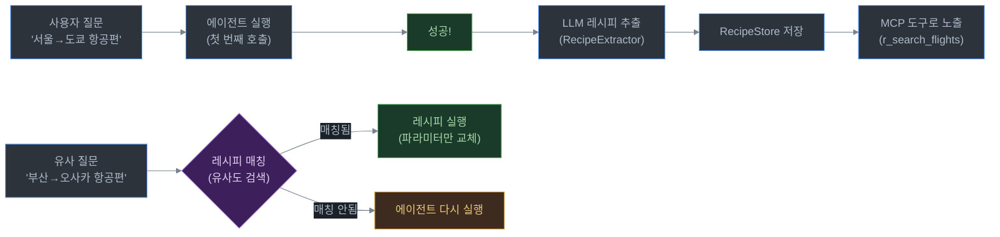

# 06. 레시피 시스템

## 목차
- [레시피 개념](#레시피-개념)
- [추출 과정 (RecipeExtractor)](#추출-과정)
- [저장소 (RecipeStore)](#저장소)
- [실행 (RecipeRunner)](#실행)
- [도구 이름 생성 규칙 (RecipeNaming)](#도구-이름-생성-규칙)
- [템플릿 문법 (TemplateRenderer)](#템플릿-문법)

---

## 레시피 개념

레시피는 **성공한 API 호출 + SQL 후처리 파이프라인을 파라미터화하여 캐싱**하는 시스템입니다.

### 왜 필요한가?

에이전트가 "서울에서 도쿄 항공편 검색"을 성공하면, 그 패턴을 기억합니다. 다음에 "부산에서 오사카 항공편 검색"이라는 유사한 질문이 오면, 에이전트를 다시 돌리지 않고 **파라미터만 바꿔서 즉시 실행**합니다.

### 전체 흐름



### 레시피 데이터 구조

```json
{
  "tool_name": "search_flights",
  "params": {
    "from": {"type": "str", "default": "ICN"},
    "to": {"type": "str", "default": "NRT"},
    "date": {"type": "str", "default": "2026-03-12"}
  },
  "steps": [
    {
      "kind": "rest",
      "name": "flights",
      "method": "GET",
      "path": "/flights",
      "query_params": {
        "from": {"$param": "from"},
        "to": {"$param": "to"},
        "date": {"$param": "date"}
      }
    }
  ],
  "sql_steps": [
    "SELECT * FROM flights ORDER BY price ASC"
  ]
}
```

---

## 추출 과정

**파일 위치**: `src/main/java/com/apiagent/recipe/RecipeExtractor.java`

Python 원본의 `recipe/extractor.py`에 대응합니다.

### LLM 기반 추출

에이전트가 질문에 성공적으로 답한 후, 별도의 LLM 호출로 실행 기록에서 레시피를 추출합니다:

```java
@Service
public class RecipeExtractor {

    public Map<String, Object> extract(
            String apiType,
            String question,
            List<Map<String, Object>> steps,
            List<String> sqlSteps
    ) {
        // 1. 추출 프롬프트 구성
        // 2. ChatClient로 LLM 호출
        // 3. JSON 응답 파싱
        // 4. 너무 단순한 경우 null 반환 (단일 쿼리, 파라미터 없음)
    }
}
```

### 추출 규칙

LLM에게 다음을 지시합니다:

**파라미터화 대상**: 사용자별 값 (ID, 검색어, 날짜, 필터, 제한 수 등)
**파라미터화 제외**: API 경로, HTTP 메서드, 필드 이름, 테이블 이름 등

**도구 이름 규칙**:
- `snake_case`, 최대 40자
- 동사로 시작 (get, list, fetch, find, search 등)
- 기존 레시피와 중복 방지

### Python 원본과의 차이

| Python (`extractor.py`) | Spring Boot (`RecipeExtractor`) |
|-------------------------|-------------------------------|
| `Agent` + `Runner.run()` | `ChatClient.prompt().call()` |
| `max_turns=6` | 단일 LLM 호출 (턴 개념 없음) |
| `@function_tool` 없음 | 도구 없음 (텍스트 생성만) |

---

## 저장소

**파일 위치**: `src/main/java/com/apiagent/recipe/RecipeStore.java`

Python 원본의 `recipe/store.py`에 대응합니다.

### RecipeStore 클래스

```java
@Component
public class RecipeStore {
    private final int maxSize;
    private final Map<String, RecipeRecord> records = new ConcurrentHashMap<>();
    private final Map<String, Set<String>> byKey = new ConcurrentHashMap<>();
    private final LinkedHashMap<String, Void> lru;  // LRU 순서 추적
}
```

### 키 구조

레시피는 `"apiId|schemaHash"` 쌍으로 그룹화됩니다:

```
apiId 예시:
  "graphql:https://api.example.com/graphql"
  "rest:https://api.example.com/spec.json|https://api.example.com"

schemaHash: 스키마 JSON의 SHA-256 해시
  → 스키마가 바뀌면 기존 레시피가 자동 무효화됩니다
```

### 유사도 매칭

`FuzzyWuzzy`(Java)를 사용하여 사용자의 질문과 저장된 레시피를 매칭합니다:

```java
private double similarity(String query, String signature) {
    // 3가지 점수의 가중 평균:
    int base = FuzzySearch.tokenSetRatio(query, signature);       // 55%
    int extra = FuzzySearch.weightedRatio(query, signature);      // 25%
    double tokenBalance = calculateTokenBalance(query, signature); // 20%

    return (0.55 * base + 0.25 * extra + 0.20 * tokenBalance) / 100.0;
}
```

> Python 원본은 `rapidfuzz`를 사용했으나, Java에서는 `FuzzyWuzzy`로 대체되었습니다. 알고리즘은 동일합니다.

### LRU 제거 정책

캐시가 `maxSize`(기본 64)를 초과하면, 가장 오래 사용하지 않은 레시피부터 제거합니다:

```java
private void evictIfNeeded() {
    while (records.size() > maxSize && !lru.isEmpty()) {
        String oldestId = lru.keySet().iterator().next();
        delete(oldestId);
    }
}
```

### 주요 메서드

| 메서드 | 설명 |
|--------|------|
| `saveRecipe(...)` | 레시피 저장, recipe_id 반환 (`r_` 접두사) |
| `getRecipe(recipeId)` | ID로 레시피 조회 (LRU 갱신) |
| `suggestRecipes(apiId, schemaHash, question, k)` | 유사도 기반 레시피 추천 (상위 k개) |
| `listRecipes(apiId, schemaHash)` | 특정 API의 모든 레시피 목록 |

---

## 실행

### RecipeRunner

**파일 위치**: `src/main/java/com/apiagent/recipe/RecipeRunner.java`

Python 원본의 `recipe/runner.py`와 `recipe/common.py`에 대응합니다.

```java
@Service
public class RecipeRunner {

    public RunResult execute(
            Map<String, Object> recipe,
            Map<String, Object> params,
            RequestContext ctx,
            String baseUrl
    ) {
        // 1. API 스텝 순차 실행
        for (Map<String, Object> step : steps) {
            if ("graphql".equals(step.get("kind"))) {
                // GraphQL 쿼리 실행 (템플릿 렌더링)
            } else {
                // REST 호출 실행 (파라미터 치환)
            }
            // 결과를 DuckDB 테이블로 저장
        }

        // 2. SQL 스텝 순차 실행
        for (String sqlTemplate : sqlSteps) {
            String sql = templateRenderer.renderText(sqlTemplate, params);
            result = duckDbExecutor.executeSql(queryResults, sql);
        }

        // 3. 결과 반환
        return new RunResult(success, lastData, executedSql, error);
    }
}
```

### RunResult

```java
public record RunResult(
    boolean success,
    Object lastData,
    List<String> executedSql,
    String error
) {}
```

---

## 도구 이름 생성 규칙

**파일 위치**: `src/main/java/com/apiagent/recipe/RecipeNaming.java`

Python 원본의 `recipe/naming.py`에 대응합니다.

### 정규화

```java
public class RecipeNaming {

    public static String sanitize(String name) {
        // "Get Recent Flights!" → "get_recent_flights"
        // null → "recipe"
    }

    public static String fromQuestion(String question) {
        // 질문에서 도구 이름 생성 (최대 40자)
        // "서울에서 도쿄행 항공편 보여줘" → "서울에서_도쿄행_항공편_보여줘"
    }

    public static String deduplicate(String baseName, Set<String> seenNames, int maxLen) {
        // "get_flights" → "get_flights" (최초)
        // "get_flights" → "get_flights_2" (중복 시)
        // "get_flights" → "get_flights_3" (또 중복 시)
    }
}
```

### MCP 도구 이름 규칙

레시피가 MCP 도구로 노출될 때:

```
내부 레시피 이름: "search_flights"
MCP 도구 이름:   "r_search_flights"  (r_ 접두사, 최대 60자)
```

---

## 템플릿 문법

**파일 위치**: `src/main/java/com/apiagent/recipe/TemplateRenderer.java`

Python 원본의 `store.py`의 `render_text_template()`과 `render_param_refs()`에 대응합니다.

### 1. `{{param}}` - 텍스트 치환 (GraphQL + SQL)

GraphQL 쿼리와 SQL에서 사용됩니다. 문자열 내에서 직접 치환합니다.

```
# GraphQL 템플릿
{ flights(from: "{{from}}", to: "{{to}}", date: "{{date}}") { id price } }

# 파라미터: {"from": "ICN", "to": "NRT", "date": "2026-03-12"}
# 렌더링 결과:
{ flights(from: "ICN", to: "NRT", date: "2026-03-12") { id price } }
```

```
# SQL 템플릿
SELECT * FROM flights WHERE price < {{max_price}} ORDER BY price ASC

# 파라미터: {"max_price": 500}
# 렌더링 결과:
SELECT * FROM flights WHERE price < 500 ORDER BY price ASC
```

**구현**:
```java
public String renderText(String template, Map<String, Object> params) {
    // 정규식: \{\{([a-zA-Z_][a-zA-Z0-9_]*)\}\}
    // 매치된 파라미터 이름으로 params에서 값을 가져와 치환
}
```

### 2. `{"$param": "name"}` - 구조적 치환 (REST)

REST API의 JSON 객체 내에서 사용됩니다. 구조를 유지하면서 값만 교체합니다.

```json
// 레시피 정의
{
  "query_params": {
    "from": {"$param": "from"},
    "to": {"$param": "to"},
    "limit": 10
  }
}

// 파라미터: {"from": "ICN", "to": "NRT"}
// 렌더링 결과:
{
  "query_params": {
    "from": "ICN",
    "to": "NRT",
    "limit": 10
  }
}
```

**구현**:
```java
public Object renderParamRefs(Object obj, Map<String, Object> params) {
    // 재귀적으로 {"$param": "x"} 노드를 params.get("x")로 치환
    if (obj instanceof Map<?, ?> map) {
        if (map.size() == 1 && map.containsKey("$param")) {
            return params.get(map.get("$param"));
        }
        // 재귀 처리
    }
    if (obj instanceof List<?> list) {
        // 재귀 처리
    }
    return obj;  // 원시값은 그대로
}
```

### 비교 정리

| 문법 | 용도 | 예시 |
|------|------|------|
| `{{param}}` | GraphQL 쿼리, SQL 문자열 | `WHERE name = '{{name}}'` |
| `{"$param": "name"}` | REST JSON 객체 | `{"id": {"$param": "userId"}}` |

---

## 다음 단계

- [07. 보안 및 설정](./07-보안-및-설정.md) - 보안 메커니즘과 전체 설정 레퍼런스
- [05. 에이전트 시스템](./05-에이전트-시스템.md) - 에이전트 시스템으로 돌아가기
