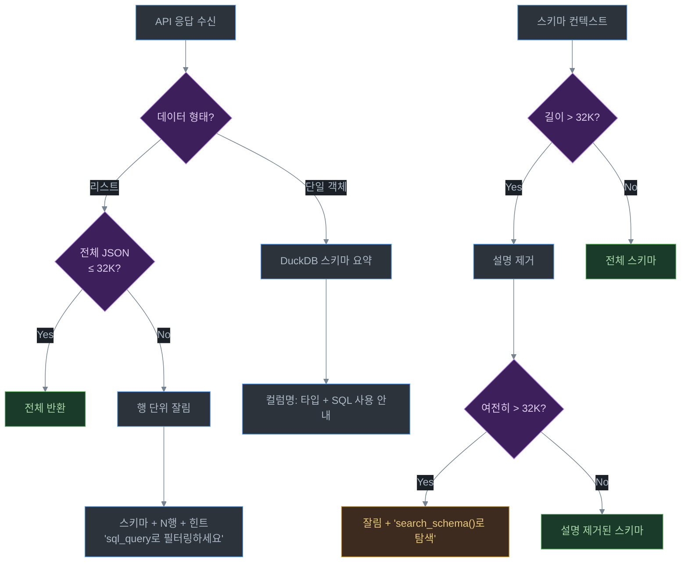

# 07. 보안 및 설정

## 목차
- [GraphQL 뮤테이션 차단](#graphql-뮤테이션-차단)
- [REST 안전하지 않은 메서드 차단](#rest-안전하지-않은-메서드-차단)
- [X-Allow-Unsafe-Paths glob 패턴](#x-allow-unsafe-paths-glob-패턴)
- [응답 크기 제한](#응답-크기-제한)
- [CORS 설정](#cors-설정)
- [전체 환경변수 레퍼런스](#전체-환경변수-레퍼런스)

---

## GraphQL 뮤테이션 차단

**파일 위치**: `src/main/java/com/apiagent/client/graphql/GraphqlClient.java`

GraphQL에서 데이터를 변경하는 `mutation` 작업은 기본적으로 **완전 차단**됩니다.

```java
// 정규식으로 mutation 키워드 감지
private static final Pattern MUTATION_PATTERN =
    Pattern.compile("^\\s*mutation\\b", Pattern.CASE_INSENSITIVE | Pattern.MULTILINE);

public Map<String, Object> execute(String query, ...) {
    if (MUTATION_PATTERN.matcher(query).find()) {
        return Map.of("success", false,
                       "error", "Mutations are not allowed (read-only mode)");
    }
    // ...
}
```

### 차단되는 예시

```graphql
# 차단됨
mutation {
  createUser(name: "John") {
    id
  }
}

# 차단됨 (대소문자 무시)
MUTATION CreateUser { ... }

# 허용됨 (query만)
{
  users { id name }
}

# 허용됨
query GetUsers {
  users { id name }
}
```

> **설정으로 해제 불가**: 뮤테이션 차단은 현재 설정으로 끌 수 없습니다. 읽기 전용 모드가 하드코딩되어 있습니다.

---

## REST 안전하지 않은 메서드 차단

**파일 위치**: `src/main/java/com/apiagent/client/rest/RestApiClient.java`

REST API에서 데이터를 변경할 수 있는 HTTP 메서드는 기본적으로 **차단**됩니다.

```java
private static final Set<String> UNSAFE_METHODS =
    Set.of("POST", "PUT", "DELETE", "PATCH");

public Map<String, Object> execute(String method, String path, ...,
                                    List<String> allowUnsafePaths) {
    method = method.toUpperCase();

    if (UNSAFE_METHODS.contains(method)) {
        if (allowUnsafePaths == null || !isPathAllowed(path, allowUnsafePaths)) {
            return Map.of("success", false,
                "error", method + " method not allowed (read-only mode). "
                       + "Use X-Allow-Unsafe-Paths header.");
        }
    }
    // ...
}
```

### 차단/허용 정리

| HTTP 메서드 | 기본 상태 | 허용 방법 |
|-------------|-----------|-----------|
| `GET` | 항상 허용 | - |
| `POST` | 차단 | `X-Allow-Unsafe-Paths` 헤더 |
| `PUT` | 차단 | `X-Allow-Unsafe-Paths` 헤더 |
| `DELETE` | 차단 | `X-Allow-Unsafe-Paths` 헤더 |
| `PATCH` | 차단 | `X-Allow-Unsafe-Paths` 헤더 |

---

## X-Allow-Unsafe-Paths glob 패턴

특정 경로에 대해서만 안전하지 않은 메서드를 허용할 수 있습니다.

### 설정 방법

HTTP 헤더로 JSON 배열 형태의 glob 패턴을 전달합니다:

```
X-Allow-Unsafe-Paths: ["/api/search", "/api/trips/*"]
```

### glob 패턴 문법

Java의 glob 패턴 매칭을 사용합니다:

| 패턴 | 의미 | 예시 |
|------|------|------|
| `*` | 모든 문자 매칭 | `/api/*` → `/api/search`, `/api/users` |
| `?` | 단일 문자 매칭 | `/api/v?/users` → `/api/v1/users` |

### 사용 예시

```java
// 패턴 매칭 로직
private boolean isPathAllowed(String path, List<String> patterns) {
    for (String pattern : patterns) {
        if (globMatch(path, pattern)) {
            return true;
        }
    }
    return false;
}
```

```
# 헤더 설정 예시
X-Allow-Unsafe-Paths: ["/search", "/trips/*/poll"]

# 허용되는 요청:
POST /search              ← "/search" 패턴 매칭
POST /trips/123/poll      ← "/trips/*/poll" 패턴 매칭

# 차단되는 요청:
POST /users               ← 매칭되는 패턴 없음
DELETE /trips/123          ← "/trips/*/poll"에 매칭 안 됨
```

> **주의**: `X-Allow-Unsafe-Paths`를 설정하지 않거나 빈 배열(`[]`)이면, 모든 POST/PUT/DELETE/PATCH가 차단됩니다.

---

## 응답 크기 제한

LLM의 컨텍스트 윈도우 오버플로우를 방지하기 위해 여러 단계에서 응답 크기를 제한합니다.

### 제한 종류

| 설정 | 기본값 | 적용 위치 | 설명 |
|------|--------|-----------|------|
| `maxToolResponseChars` | 32,000자 | 에이전트 도구 응답 | ~8K 토큰. 에이전트 루프 내에서 도구가 LLM에 반환하는 응답 |
| `maxResponseChars` | 50,000자 | MCP 도구 응답 | `_query` 도구의 최대 응답 크기 |
| `maxSchemaChars` | 32,000자 | 스키마 컨텍스트 | LLM에 전달되는 스키마 정보 |

### 잘림(Truncation) 전략

**파일 위치**: `src/main/java/com/apiagent/util/ResponseTruncator.java`



### ResponseTruncator 3단계

```java
@Component
public class ResponseTruncator {

    // 1단계: 전체 JSON이 limit 이하 → 그대로 반환
    // 2단계: List 데이터 → 행 단위로 잘라서 포함
    //        "[SHOWING N/M rows]" 접미사 추가
    // 3단계: 단순 substring 잘림 + "[TRUNCATED]" 마커
}
```

---

## CORS 설정

**파일 위치**: `src/main/java/com/apiagent/config/CorsConfig.java`

MCP 서버가 브라우저 기반 클라이언트의 요청을 받을 수 있도록 CORS를 설정합니다.

```java
@Configuration
public class CorsConfig implements WebMvcConfigurer {

    @Override
    public void addCorsMappings(CorsRegistry registry) {
        registry.addMapping("/**")
                .allowedOrigins(parsedOrigins)  // corsAllowedOrigins에서 파싱
                .allowedMethods("*")
                .allowedHeaders("*");
    }
}
```

### CORS 관련 설정

| 환경변수 | 기본값 | 설명 |
|----------|--------|------|
| `API_AGENT_CORS_ALLOWED_ORIGINS` | `*` | 허용 도메인 (쉼표 구분) |

```bash
# 모든 도메인 허용 (개발용)
API_AGENT_CORS_ALLOWED_ORIGINS=*

# 특정 도메인만 허용 (프로덕션)
API_AGENT_CORS_ALLOWED_ORIGINS=https://app.example.com,https://admin.example.com
```

---

## 전체 환경변수 레퍼런스

### MCP 서버 설정

| 환경변수 | 기본값 | 설명 |
|----------|--------|------|
| `API_AGENT_MCP_NAME` | `"API Agent"` | MCP 서버 표시 이름 |
| `API_AGENT_SERVICE_NAME` | `"api-agent"` | OpenTelemetry 서비스 이름 |
| `API_AGENT_PORT` (= `server.port`) | `3000` | 서버 포트 |
| `API_AGENT_DEBUG` | `false` | 디버그 모드 (상세 로깅) |
| `API_AGENT_CORS_ALLOWED_ORIGINS` | `"*"` | CORS 허용 도메인 (쉼표 구분) |
| `API_AGENT_LOG_LEVEL` | `INFO` | 로그 레벨 (`DEBUG`, `INFO`, `WARN`, `ERROR`) |

### LLM 설정

| 환경변수 | 기본값 | 설명 |
|----------|--------|------|
| `OPENAI_API_KEY` | (필수) | OpenAI API 키 |
| `OPENAI_BASE_URL` | `"https://api.openai.com/v1"` | OpenAI 호환 API 엔드포인트 |
| `API_AGENT_MODEL_NAME` | `"gpt-4o"` | LLM 모델 이름 |
| `API_AGENT_REASONING_EFFORT` | `""` (비활성) | 추론 노력 수준: `low`, `medium`, `high` |

### 에이전트 제한

| 환경변수 | 기본값 | 설명 |
|----------|--------|------|
| `API_AGENT_MAX_AGENT_TURNS` | `30` | 에이전트 최대 도구 호출 횟수 |
| `API_AGENT_MAX_RESPONSE_CHARS` | `50000` | MCP 도구 최대 응답 크기 |
| `API_AGENT_MAX_SCHEMA_CHARS` | `32000` | 스키마 컨텍스트 최대 크기 |
| `API_AGENT_MAX_PREVIEW_ROWS` | `10` | 페이지네이션 제안 전 미리보기 행 수 |
| `API_AGENT_MAX_TOOL_RESPONSE_CHARS` | `32000` | 에이전트 도구 응답 최대 크기 |

### 폴링 설정

| 환경변수 | 기본값 | 설명 |
|----------|--------|------|
| `API_AGENT_MAX_POLLS` | `20` | 폴링 최대 시도 횟수 |
| `API_AGENT_DEFAULT_POLL_DELAY_MS` | `3000` | 폴링 기본 대기 시간 (밀리초) |

### 레시피 설정

| 환경변수 | 기본값 | 설명 |
|----------|--------|------|
| `API_AGENT_ENABLE_RECIPES` | `true` | 레시피 캐싱 활성화 |
| `API_AGENT_RECIPE_CACHE_SIZE` | `64` | LRU 캐시 최대 항목 수 |

### 트레이싱 설정

Spring Boot Actuator + Micrometer + OpenTelemetry를 사용합니다.

| 환경변수 | 기본값 | 설명 |
|----------|--------|------|
| `management.tracing.enabled` | `false` | 트레이싱 활성화 (application.yml) |
| `OTEL_EXPORTER_OTLP_ENDPOINT` | (없음) | OpenTelemetry OTLP 엔드포인트 |

### HTTP 헤더 레퍼런스

MCP 클라이언트가 요청 시 전달하는 커스텀 HTTP 헤더:

| 헤더 | 필수 | 설명 |
|------|------|------|
| `X-Target-URL` | 필수 | 대상 API URL (GraphQL 엔드포인트 또는 OpenAPI 스펙 URL) |
| `X-API-Type` | 필수 | API 유형: `graphql` 또는 `rest` |
| `X-Target-Headers` | 선택 | 대상 API에 전달할 헤더 (JSON). 예: `{"Authorization": "Bearer token"}` |
| `X-API-Name` | 선택 | 도구 이름 접두사 오버라이드. 미지정 시 URL에서 자동 추출 |
| `X-Allow-Unsafe-Paths` | 선택 | POST/PUT/DELETE/PATCH 허용 경로 (JSON 배열, glob 패턴) |
| `X-Base-URL` | 선택 | REST API 기본 URL 오버라이드 (OpenAPI 스펙의 servers 대신 사용) |
| `X-Include-Result` | 선택 | 응답에 전체 결과 포함 여부: `true`/`false` (기본: `false`) |
| `X-Poll-Paths` | 선택 | 폴링 필요 경로 (JSON 배열). 설정하면 폴링 기능 활성화 |

---

## 다음 단계

- [08. 테스트 가이드](./08-테스트-가이드.md) - 테스트 실행 및 작성 방법
- [06. 레시피 시스템](./06-레시피-시스템.md) - 레시피 시스템으로 돌아가기
